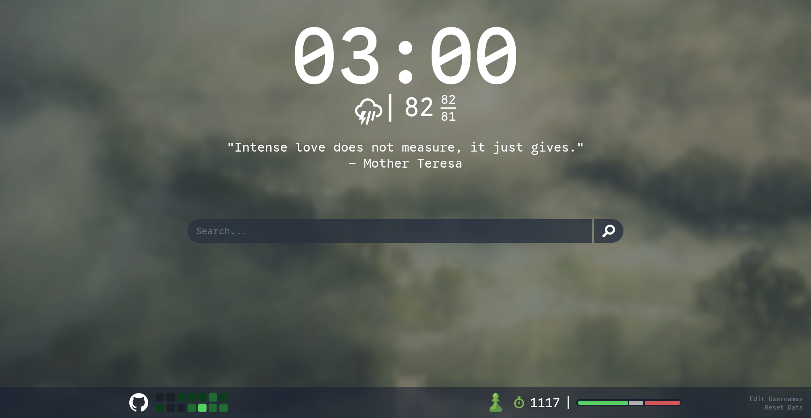
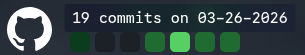
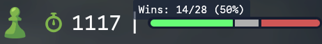

# Browser Homepage

This is a web-based personal dashboard with time, weather, daily quotes, random daily backgrounds, a google search bar, a recent GitHub commits tracker, and Chess.com data! Everything was designed to be smoothly animated and was made with just HTML, CSS, and JS.

## Features
 - **Background**: Random daily backgrounds from [Lorem Picsum](https://picsum.photos/), cached in the browser for quick loading
 - **Time & Weather**: Minute and hour clock and weather information (only shows if successfully fetched from [Open-Meteo](https://open-meteo.com/))
 - **Daily Quotes**: Today's daily quote from [ZenQuotes.io](https://zenquotes.io/)
 - **Search bar**: Opens a Google search in a new tab for what you typed
 - **GitHub Stats**: (Semi) accurately shows your last 2 weeks of commits (up to 100) with more information on hover using [GitHub REST API](https://docs.github.com/en/rest) 

 
 - **Chess.com Stats**: Show's your rating and W-D-L record of your most played mode on Chess.com (with more information on hover) using [Chess.com's PubAPI](https://www.chess.com/news/view/published-data-api) 

 
 - **Client-Side**: Everyhing is done client-side without a server, with data stored in localStorage

## APIs

All APIs used do not require API keys or OAuth
 - [Lorem Picsum](https://picsum.photos/) - Background images
 - [Open-Meteo](https://open-meteo.com/) - Weather data
 - [ZenQuotes.io](https://zenquotes.io/) - Daily quotes
 - [GitHub REST API](https://docs.github.com/en/rest) - GitHub data
 - [Chess.com's PubAPI](https://www.chess.com/news/view/published-data-api) - Chess.com data

## Usage

Try it [here](https://constintcreations.github.io/Browser-Homepage/)!